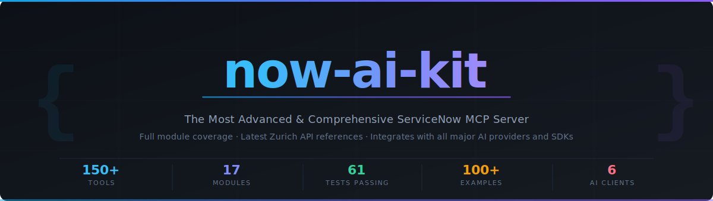

<div align="center">



<br/>

[](https://www.npmjs.com/package/now-ai-kit)
[](https://www.npmjs.com/package/now-ai-kit)
[](tests/)
[](https://www.typescriptlang.org/)
[](LICENSE)
[](https://developer.servicenow.com)
[](https://modelcontextprotocol.io)

<br/>

**now-ai-kit** is the most advanced, comprehensive, and thoroughly tested ServiceNow MCP server available.
It provides complete coverage across all major ServiceNow modules using the latest Zurich API references,
with seamless, production-ready integration across all major AI providers and SDKs.

<br/>

</div>

---

## Why now-ai-kit

<table>
<tr>
<td width="33%" valign="top">

### Broadest Module Coverage

150+ production-ready tools spanning every ServiceNow domain: ITSM, ITOM, HRSD, CSM, SecOps, GRC, Agile, ATF, Flow Designer, Scripting, Reporting, Now Assist, and more. No other MCP server comes close to this depth.

</td>
<td width="33%" valign="top">

### Any AI Provider or SDK

Works out of the box with **Claude**, **GPT-4o**, **Gemini / Vertex AI**, **Cursor**, **VS Code Copilot**, and **OpenAI Codex**. OAuth 2.0 and Basic Auth supported for every client. Role-based tool packages let you expose exactly the right tools per persona.

</td>
<td width="33%" valign="top">

### Thoroughly Tested & Production-Ready

61 unit tests, four-tier permission system, role-based tool packages, 100+ real-world examples, and complete documentation. Built on the ServiceNow Zurich release APIs with full TypeScript types throughout.

</td>
</tr>
</table>

---

## Quick Links

| Resource | Link |
|----------|------|
| All 150+ Tools Reference | [docs/TOOLS.md](docs/TOOLS.md) |
| Client Setup (Claude, GPT, Gemini, Cursor, VS Code) | [docs/CLIENT_SETUP.md](docs/CLIENT_SETUP.md) |
| Role-Based Tool Packages | [docs/TOOL_PACKAGES.md](docs/TOOL_PACKAGES.md) |
| Now Assist & AI Integration | [docs/NOW_ASSIST.md](docs/NOW_ASSIST.md) |
| ATF Testing Guide | [docs/ATF.md](docs/ATF.md) |
| Scripting Management | [docs/SCRIPTING.md](docs/SCRIPTING.md) |
| Reporting & Analytics | [docs/REPORTING.md](docs/REPORTING.md) |
| Multi-Instance Setup | [docs/MULTI_INSTANCE.md](docs/MULTI_INSTANCE.md) |
| 100+ Real-World Examples | [EXAMPLES.md](EXAMPLES.md) |
| Changelog | [CHANGELOG.md](CHANGELOG.md) |

---

## Module Coverage

17 domain modules covering the full ServiceNow platform:

| Module | Tools | Key Capabilities |
|--------|------:|-----------------|
| Core & CMDB | 16 | Record query, schema discovery, CMDB CIs, ITOM Discovery, MID Servers |
| Incident Management | 7 | Full incident lifecycle — create, update, resolve, close, work notes |
| Problem Management | 4 | Problem records, root cause analysis, known errors |
| Change Management | 5 | Change requests, CAB approvals, closures |
| Task Management | 4 | Generic tasks, my-task lists, completions |
| Knowledge Base | 6 | Search, create, update, publish KB articles |
| Service Catalog & Approvals | 10 | Catalog browsing, order items, SLA tracking, approval workflows |
| User & Group Management | 8 | Users, groups, membership, role assignments |
| Reporting & Analytics | 8 | Aggregate queries, trend analysis, Performance Analytics, scheduled jobs |
| ATF Testing | 9 | Test suites, test execution, Zurich Failure Insight |
| Now Assist / AI | 10 | NLQ, AI Search, summaries, resolution suggestions, Agentic Playbooks |
| Scripting | 16 | Business rules, script includes, client scripts, changesets |
| Agile / Scrum | 9 | Stories, epics, sprints, scrum tasks |
| HR Service Delivery (HRSD) | 12 | HR cases, HR services, employee profiles, onboarding/offboarding |
| Customer Service Management (CSM) | 11 | Customer cases, accounts, contacts, products, SLAs |
| Security Operations & GRC | 11 | SecOps incidents, vulnerabilities, GRC risks, controls, threat intel |
| Flow Designer & Process Automation | 10 | Flows, subflows, triggers, executions, Process Automation playbooks |

---

## Authentication

Both **Basic Auth** and **OAuth 2.0** are fully supported across all client integrations:

| Method | Best For |
|--------|----------|
| Basic Auth | Development, personal instances, quick setup |
| OAuth 2.0 Client Credentials | Production deployments, service accounts |
| OAuth 2.0 Password Grant | Automated CI/CD pipelines |

---

## Permission System

A four-tier permission model keeps your instance safe by default:

| Tier | Environment Variable | Covers |
|------|---------------------|--------|
| 0 — Read | *(always on)* | All query and read operations |
| 1 — Write | `WRITE_ENABLED=true` | Create/update across ITSM, HRSD, CSM, Agile |
| 2 — CMDB Write | `CMDB_WRITE_ENABLED=true` | CI create/update in the CMDB |
| 3 — Scripting | `SCRIPTING_ENABLED=true` | Business rules, script includes, changesets |
| 4 — Now Assist | `NOW_ASSIST_ENABLED=true` | AI Agentic Playbooks, NLQ, AI Search |

---

## Role-Based Tool Packages

Set `MCP_TOOL_PACKAGE` to expose only the tools relevant to each persona:

| Package | Persona | Tools Included |
|---------|---------|---------------|
| `full` | Administrators | All 150+ tools |
| `service_desk` | L1/L2 Agents | Incidents, tasks, approvals, KB, SLA |
| `change_coordinator` | Change Managers | Changes, CAB, CMDB, approvals |
| `knowledge_author` | KB Authors | Knowledge base create/publish |
| `catalog_builder` | Catalog Admins | Catalog, users, groups |
| `system_administrator` | Sys Admins | Users, groups, reports, logs |
| `platform_developer` | Developers | Scripts, ATF, changesets |
| `itom_engineer` | ITOM Engineers | CMDB, Discovery, MID servers, events |
| `agile_manager` | Scrum Masters | Stories, epics, sprints |
| `ai_developer` | AI Builders | Now Assist, NLQ, Agentic Playbooks |

---

## Getting Started

### Prerequisites

- **Node.js 20+** — [nodejs.org](https://nodejs.org)
- A **ServiceNow instance** (free developer instance at [developer.servicenow.com](https://developer.servicenow.com))
- An AI client: Claude Desktop, Claude Code, Cursor, VS Code, or any OpenAI/Gemini-compatible client

### Install

```bash
# Option A — npm (recommended)
npm install -g now-ai-kit

# Option B — clone from source
git clone https://github.com/habenani-p/servicenow-mcp.git
cd servicenow-mcp
npm install && npm run build
```

### Configure

```bash
cp .env.example .env
```

Edit `.env`:

```env
# ServiceNow instance URL (no trailing slash)
SERVICENOW_INSTANCE_URL=https://yourinstance.service-now.com

# Auth method: basic or oauth
SERVICENOW_AUTH_METHOD=basic
SERVICENOW_BASIC_USERNAME=your.username
SERVICENOW_BASIC_PASSWORD=your_password

# Permission gates (start with all off for safety)
WRITE_ENABLED=false
CMDB_WRITE_ENABLED=false
SCRIPTING_ENABLED=false
NOW_ASSIST_ENABLED=false

# Optional: limit tools to a role package
# MCP_TOOL_PACKAGE=service_desk
```

### Connect to Claude Desktop

Find your config file:
- **macOS**: `~/Library/Application Support/Claude/claude_desktop_config.json`
- **Windows**: `%APPDATA%\Claude\claude_desktop_config.json`
- **Linux**: `~/.config/Claude/claude_desktop_config.json`

Add the server:

```json
{
  "mcpServers": {
    "now-ai-kit": {
      "command": "node",
      "args": ["/absolute/path/to/servicenow-mcp/dist/server.js"],
      "env": {
        "SERVICENOW_INSTANCE_URL": "https://yourinstance.service-now.com",
        "SERVICENOW_AUTH_METHOD": "basic",
        "SERVICENOW_BASIC_USERNAME": "your.username",
        "SERVICENOW_BASIC_PASSWORD": "your_password",
        "WRITE_ENABLED": "false"
      }
    }
  }
}
```

Restart Claude Desktop. You will see now-ai-kit listed in the MCP servers panel.

### Connect to Claude Code

```bash
claude mcp add now-ai-kit node /absolute/path/to/servicenow-mcp/dist/server.js \
  --env SERVICENOW_INSTANCE_URL=https://yourinstance.service-now.com \
  --env SERVICENOW_AUTH_METHOD=basic \
  --env SERVICENOW_BASIC_USERNAME=your.username \
  --env SERVICENOW_BASIC_PASSWORD=your_password
```

### Connect to Cursor

Create `.cursor/mcp.json` in your project root:

```json
{
  "mcpServers": {
    "now-ai-kit": {
      "command": "node",
      "args": ["/absolute/path/to/servicenow-mcp/dist/server.js"],
      "env": {
        "SERVICENOW_INSTANCE_URL": "https://yourinstance.service-now.com",
        "SERVICENOW_AUTH_METHOD": "basic",
        "SERVICENOW_BASIC_USERNAME": "your.username",
        "SERVICENOW_BASIC_PASSWORD": "your_password"
      }
    }
  }
}
```

For full setup guides for every client (including OAuth 2.0 variants), see [docs/CLIENT_SETUP.md](docs/CLIENT_SETUP.md).

---

## Example Interactions

Once connected, ask your AI assistant in plain language:

```
Show me all open P1 incidents assigned to the Network Operations group.
```
```
Create an incident for a VPN outage affecting the London office, high urgency, assign to IT Network team.
```
```
What CMDB CIs does the ERP application depend on?
```
```
Run the Regression Test Suite and show me any failures with Zurich Failure Insight details.
```
```
Summarise the last 30 days of incident trends by category.
```
```
Open an HR onboarding case for new employee Jane Smith starting Monday.
```
```
List all high-severity vulnerabilities on production servers that are still open.
```
```
Trigger the Employee Offboarding flow for user john.doe with effective date 2025-03-01.
```
```
Find all customer cases for Acme Corp that are past their SLA breach date.
```
```
Show me GRC risks in the Data Privacy category that are still in draft state.
```

For 100+ real-world examples with expected inputs, outputs, and advanced workflows, see [EXAMPLES.md](EXAMPLES.md).

---

## Advanced Configuration

### OAuth 2.0

```env
SERVICENOW_AUTH_METHOD=oauth
SERVICENOW_INSTANCE_URL=https://yourinstance.service-now.com
SERVICENOW_CLIENT_ID=your_oauth_client_id
SERVICENOW_CLIENT_SECRET=your_oauth_client_secret
SERVICENOW_OAUTH_GRANT_TYPE=client_credentials
```

### Multi-Instance Setup

Manage multiple ServiceNow environments with `instances.json`:

```json
{
  "instances": [
    {
      "name": "production",
      "url": "https://prod.service-now.com",
      "authMethod": "oauth",
      "clientId": "...",
      "clientSecret": "..."
    },
    {
      "name": "dev",
      "url": "https://dev12345.service-now.com",
      "authMethod": "basic",
      "username": "admin",
      "password": "..."
    }
  ]
}
```

See [docs/MULTI_INSTANCE.md](docs/MULTI_INSTANCE.md) for full instructions.

### Docker

```bash
docker build -t now-ai-kit .
docker run -e SERVICENOW_INSTANCE_URL=https://yourinstance.service-now.com \
           -e SERVICENOW_AUTH_METHOD=basic \
           -e SERVICENOW_BASIC_USERNAME=admin \
           -e SERVICENOW_BASIC_PASSWORD=password \
           now-ai-kit
```

---

## Supported AI Clients

| Client | Auth Methods | Config Guide |
|--------|-------------|-------------|
| Claude Desktop | Basic, OAuth 2.0 | [clients/claude-desktop/SETUP.md](clients/claude-desktop/SETUP.md) |
| Claude Code | Basic, OAuth 2.0 | [clients/claude-code/SETUP.md](clients/claude-code/SETUP.md) |
| Cursor | Basic, OAuth 2.0 | [clients/cursor/SETUP.md](clients/cursor/SETUP.md) |
| VS Code (Copilot) | Basic, OAuth 2.0 | [clients/vscode/SETUP.md](clients/vscode/SETUP.md) |
| OpenAI Codex | Basic, OAuth 2.0 | [clients/codex/SETUP.md](clients/codex/SETUP.md) |
| Google Gemini / Vertex AI | Basic, OAuth 2.0 | [clients/gemini/SETUP.md](clients/gemini/SETUP.md) |

---

## What's New in v2.0

- **154 tools** across 17 domain modules (up from 16 tools in v1.0)
- **HRSD module** — HR cases, services, profiles, onboarding/offboarding workflows
- **CSM module** — Customer cases, accounts, contacts, products, SLA tracking
- **Security Operations & GRC** — SecOps incidents, vulnerabilities, risks, controls, threat intel
- **Flow Designer** — List, inspect, trigger, and monitor flows and subflows
- **OAuth 2.0** for all six AI clients
- **Role-based tool packages** — 10 persona-specific packages
- **Now Assist Agentic Playbooks** — Zurich release AI automation
- **ATF Failure Insight** — Zurich-release test failure diagnostics
- **61 unit tests** covering all permission tiers, routing, and domain handlers
- **Complete documentation** — 8 reference guides in `docs/`

---

## Documentation

| Guide | Description |
|-------|-------------|
| [docs/TOOLS.md](docs/TOOLS.md) | Complete reference for all 150+ tools with parameters, return types, and permission requirements |
| [docs/CLIENT_SETUP.md](docs/CLIENT_SETUP.md) | Step-by-step setup for all six AI clients, both Basic Auth and OAuth 2.0 |
| [docs/TOOL_PACKAGES.md](docs/TOOL_PACKAGES.md) | Role-based package reference — which tools each persona package includes |
| [docs/NOW_ASSIST.md](docs/NOW_ASSIST.md) | Now Assist and AI integration guide — NLQ, AI Search, Agentic Playbooks |
| [docs/ATF.md](docs/ATF.md) | ATF testing guide — suites, test runs, Zurich Failure Insight |
| [docs/SCRIPTING.md](docs/SCRIPTING.md) | Scripting management — business rules, script includes, changesets |
| [docs/REPORTING.md](docs/REPORTING.md) | Reporting and analytics — aggregate queries, Performance Analytics |
| [docs/MULTI_INSTANCE.md](docs/MULTI_INSTANCE.md) | Multi-instance configuration via `instances.json` or environment variables |
| [EXAMPLES.md](EXAMPLES.md) | 100+ real-world examples with inputs, outputs, and advanced workflows |

---

## Development

```bash
# Install dependencies
npm install

# Run in development mode (hot reload)
npm run dev

# Build
npm run build

# Run all tests
npm test

# Type check
npm run type-check

# Lint
npm run lint
```

### Project Structure

```
src/
  server.ts              — MCP server entry point
  servicenow/
    client.ts            — ServiceNow REST API client (Basic + OAuth)
    types.ts             — Full TypeScript type definitions
  tools/
    index.ts             — Tool router & role-based package system
    core.ts              — Core platform & CMDB (16 tools)
    incident.ts          — Incident management (7 tools)
    problem.ts           — Problem management (4 tools)
    change.ts            — Change management (5 tools)
    task.ts              — Task management (4 tools)
    knowledge.ts         — Knowledge base (6 tools)
    catalog.ts           — Service catalog & approvals (10 tools)
    user.ts              — User & group management (8 tools)
    reporting.ts         — Reporting & analytics (8 tools)
    atf.ts               — ATF testing (9 tools)
    now-assist.ts        — Now Assist / AI (10 tools)
    script.ts            — Scripting management (16 tools)
    agile.ts             — Agile / Scrum (9 tools)
    hrsd.ts              — HR Service Delivery (12 tools)
    csm.ts               — Customer Service Management (11 tools)
    security.ts          — Security Operations & GRC (11 tools)
    flow.ts              — Flow Designer & Process Automation (10 tools)
  utils/
    permissions.ts       — Four-tier permission gate functions
    errors.ts            — Typed error classes
tests/
  tools/                 — Unit tests (61 passing)
docs/                    — Reference documentation (8 guides)
clients/                 — Per-client setup and config files
  claude-desktop/
  claude-code/
  cursor/
  vscode/
  codex/
  gemini/
```

---

## Contributing

Contributions are welcome. Please read [CONTRIBUTING.md](CONTRIBUTING.md) before opening a pull request.

- Bug reports and feature requests: [open an issue](../../issues)
- New tool domains, additional tests, or documentation improvements are especially appreciated
- All PRs require `npm test` to pass

---

## Security

If you discover a security vulnerability, please follow the responsible disclosure process in [SECURITY.md](SECURITY.md). Do not open a public issue.

---

## License

[MIT](LICENSE) — free for personal and commercial use.

---

<div align="center">

If now-ai-kit saves you time, please consider starring the repository — it helps others discover the project.

[](../../stargazers)

</div>
